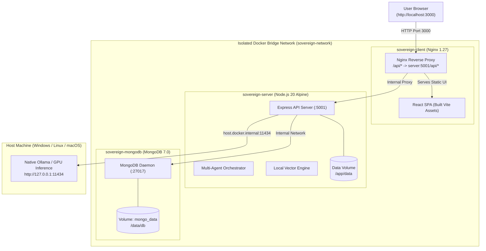

# Sovereign AI Enterprise Workbench — Docker Deployment Guide

This document describes how to build, deploy, and manage the containerized **Sovereign AI Enterprise Workbench** using Docker and Docker Compose.

---

## 1. Architectural Overview



---

## 2. Prerequisites

- **Docker Desktop** (version 24.0+ or Docker Engine with Docker Compose v2)
  - Windows: Docker Desktop with WSL2 backend enabled.
  - Linux: Docker Engine + `docker-compose-plugin`.
  - macOS: Docker Desktop.

---

## 3. Quick Start (Production Mode)

To start the complete production-grade application stack (Frontend, Backend, and MongoDB):

```bash
# 1. (Optional) Copy environment template if you wish to adjust ports or secrets
cp .env.docker.example .env

# 2. Build and launch all containers in detached mode
docker compose up --build -d

# 3. Check health and status of the running containers
docker compose ps
```

### Accessing the Services

| Service | Container Name | Host URL | Description |
| :--- | :--- | :--- | :--- |
| **Frontend UI** | `sovereign-client` | [http://localhost:3000](http://localhost:3000) | Full SPA React workbench served via Nginx |
| **Backend API** | `sovereign-server` | [http://localhost:5001/api/health](http://localhost:5001/api/health) | REST API & healthcheck endpoint |
| **Database** | `sovereign-mongodb` | `mongodb://localhost:27017` | Persistent MongoDB 7.0 daemon |

To view real-time logs:
```bash
docker compose logs -f
```

To stop the containers:
```bash
docker compose down
```

---

## 4. Development Mode (Live Hot Reloading)

If you are developing features and want instant code hot-reloading for both the frontend and backend without rebuilding Docker images:

```bash
# Start development stack
docker compose -f docker-compose.dev.yml up --build
```

- **Frontend with Vite HMR**: [http://localhost:5173](http://localhost:5173)
- **Backend with Node `--watch`**: [http://localhost:5001](http://localhost:5001)
- Source code in `./client` and `./server` are bind-mounted into the containers. Any file saved will immediately trigger hot-reloading.

---

## 5. Local LLM / Inference Configuration (Ollama)

The Sovereign AI Workbench is privacy-first and designed for air-gapped or local inference.

### Option A: Using Ollama Running on Your Host Machine (Recommended)
Running Ollama directly on your host machine enables direct native GPU acceleration (NVIDIA CUDA, Apple Metal, or AMD ROCm).

1. Start Ollama on your host:
   ```bash
   ollama run qwen2.5-coder:1.5b
   ```
2. The Docker container is pre-configured with `host.docker.internal:host-gateway`. It communicates with your host's Ollama at `http://host.docker.internal:11434` seamlessly.
3. If Ollama is offline or not installed, the server automatically uses high-speed deterministic mock fallback (`ALLOW_DETERMINISTIC_FALLBACK=true`).

### Option B: Running Ollama Inside Docker
If you do not have Ollama installed on the host and want Docker to run Ollama:

```bash
# Launch with the 'with-llm' profile
docker compose --profile with-llm up --build -d

# Pull the model inside the Ollama container
docker compose exec ollama ollama pull qwen2.5-coder:1.5b
```

Then update `OLLAMA_HOST=http://ollama:11434` in your `.env` or compose configuration.

---

## 6. Data Persistence & Backups

Two persistent Docker named volumes protect all system data:
1. `sovereign_mongo_data`: Stores MongoDB collections (users, audit trails, agent logs, playground workflows).
2. `sovereign_server_data`: Stores local vector indexes, uploaded documents, demo fixtures, and image model datasets.

### Backing Up MongoDB
```bash
docker compose exec mongodb mongodump --db sovereign_ai_db --out /data/db/backup
```

### Backing Up Vector Indices & Server Assets
```bash
docker compose exec server tar czf /app/data/data_backup.tar.gz -C /app/data vectordb image-models
```

---

## 7. Air-Gapped / Offline Deployment

To deploy this workbench to an isolated, air-gapped machine with **NO internet access**:

### On an Internet-Connected Machine:
```bash
# 1. Build the production images
docker compose build

# 2. Save images to a tarball archive
docker save -o sovereign-ai-stack.tar \
  mongo:7.0 \
  sovereign-ai-117-muilt-agent-ai-workbench-server:latest \
  sovereign-ai-117-muilt-agent-ai-workbench-client:latest
```

### On the Air-Gapped Machine:
```bash
# 1. Transfer the tarball and repository files via approved media
# 2. Load the Docker images
docker load -i sovereign-ai-stack.tar

# 3. Launch without pulling
docker compose up -d --no-build
```

---

## 8. Common Maintenance Commands

| Task | Command |
| :--- | :--- |
| **Restart all services** | `docker compose restart` |
| **Inspect Server Logs** | `docker compose logs -f server` |
| **Open Shell in Backend** | `docker compose exec server sh` |
| **Open MongoDB Shell** | `docker compose exec mongodb mongosh sovereign_ai_db` |
| **Reset Data & Volumes** | `docker compose down -v` |
| **Check System Health** | `curl -f http://localhost:5001/api/health` |
