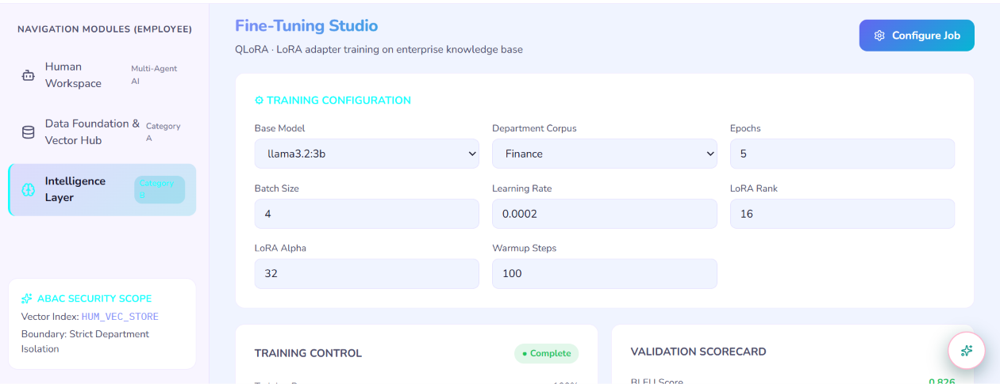
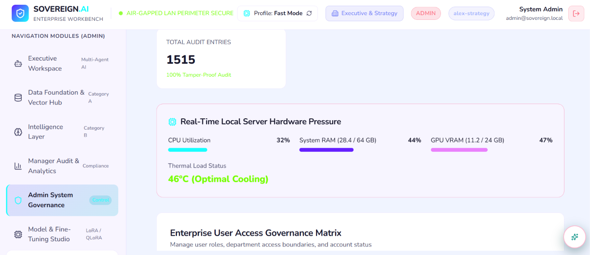
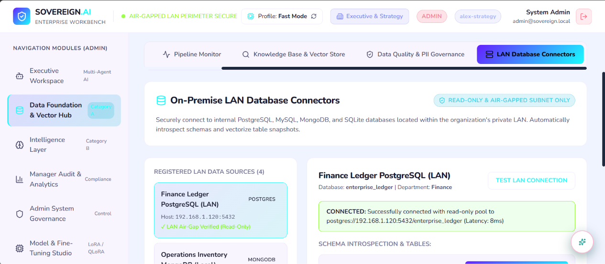

there miss mapping in the system 

1=> admin as to create and fine tune new agent he create and delpoy new agent in the system. with data files and in formation with key belongs to company confidential data.

2=>all other users can only use the agent created by admin and they can not create or modify train any agent in the system. 

3=> admin can monitor the performance of the agents and make necessary adjustments to improve their efficiency.he will be having access to all the data and information related to the agents, including their training data, performance metrics, and user feedback.wt other ppl are asking and how good thy response

4=>admin will have all agents list and he can only provide access to specific agents to other users based on their roles and responsibilities.

5=>remove human resource section in login .

6=>as soon as admin deploy a agent tht agent as to be present and be avable for all other users panel dashboard.

7=>uploading document feature is not working properly ,uploaded successfull message is showing but in index panel not showling and storing

8=>

in tht fine tune i need two more option ,add train data file and add test data file this section should be available for all .so tht all trin there individual agent,and admin created once are delpoy and access by all other ,but other trained are going to be with in there tained registry and remove or tune again option to there

9=>  
in this image admin hardware is not real time its not correct ,make it real time details

10=>

in this admin need to hve option to create a LAN network setup includes minimal setup key requriment for estblished newwork  once setup thn he host tht newwork 
a unique key will be generated for that network and he can share tht key with other users to join the network. all the users who join the network will have access to the agents deployed in that network and they can communicate with each other through the network.

